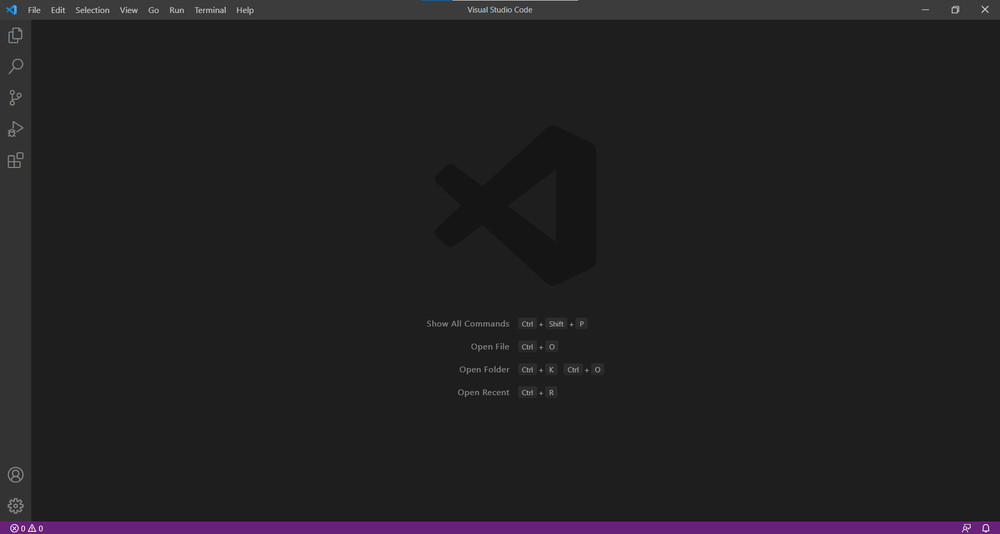
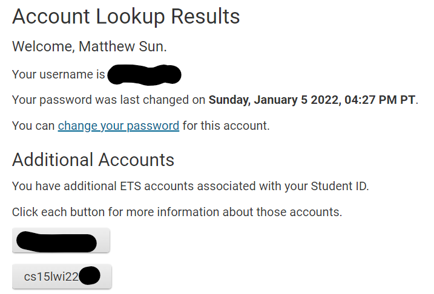
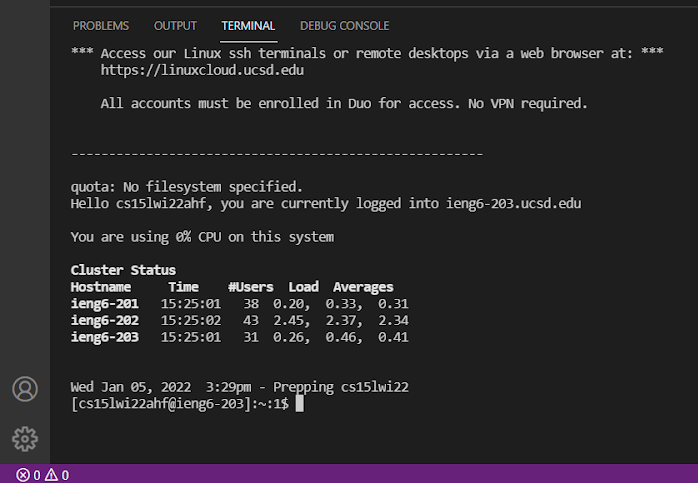
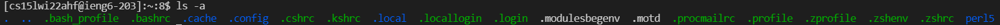
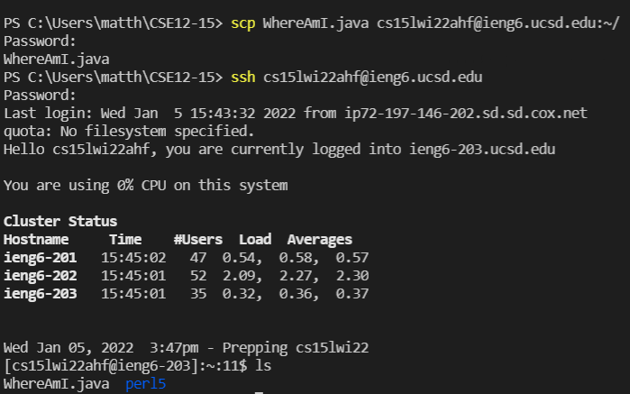
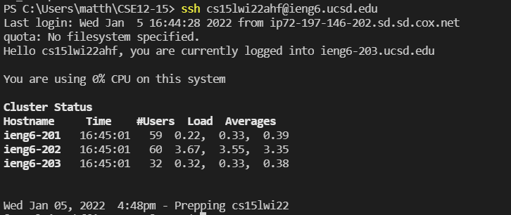
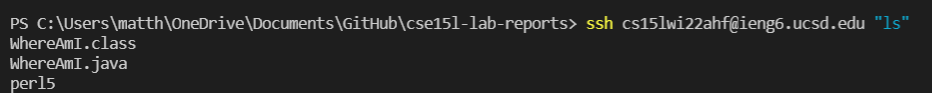

# Week 2 Lab Report

[To Home](https://matthewrsun.github.io/cse15l-lab-reports/)

## Installing VSCode

To install VSCode, visit the Visual Studio Code website at [this link](https://code.visualstudio.com/). Pick the version for your operating system, and once you finish downloading VSCode, run the program. A window should appear like the one below:



## Remotely Connecting

The next step is to be able to connect to a remote server. For this, we're going to use a program called OpenSSH, which can be downloaded here: [OpenSSH Install Instructions](https://docs.microsoft.com/en-us/windows-server/administration/openssh/openssh_install_firstuse). After this, you can login to the remote ieng6 server using your unique student account, which can be found here: [UCSD Account Finder](https://sdacs.ucsd.edu/~icc/index.php). You can also find and change your account's password there too.


Now, you are able to login to a remote server using the VSCode terminal. Open up a terminal and run this code:

`$ ssh cs15lwi22ahf@ieng6.ucsd.edu`

Don't forget to replace the letters after "wi22" with your personal account! Enter your password and you should be in!



## Trying Some Commands

Once you're in, you can try using some commands in the server. Some such commands include:

```
cd ~
cd
ls
ls -lat
ls -a
```

Here is an example, where I ran the command `ls -a`.



## Moving Files with scp

A command we are going to use now is `scp`, which copies a file from the client (the device you're using) onto the server. This command is run from the client. In my example, I used a file called WhereAmI.java. The command I used was this:

`scp WhereAmI.java cs15lwi22ahf@ieng6.ucsd.edu`



A prompt will pop up asking for your password, similar to when you were logging in, and after you enter your password, you should be able to see that your file has been copied over. Now, you will be able to find the file in the server directory.


## Setting an SSH Key

Not bad so far, right? However, it would be nice to be able to do all these things without needing to enter in your password every time you do something. So, it's time to set up an SSH key. This creates a key on both your client and the server that contains your password so that you don't need to enter it when logging in. Here is some convenient code that Professor Joe has graciously provided us with:

```
# on client (your computer)
$ ssh-keygen
Generating public/private rsa key pair.
Enter file in which to save the key (/Users/joe/.ssh/id_rsa): /Users/joe/.ssh/id_rsa
Enter passphrase (empty for no passphrase): 
Enter same passphrase again: 
Your identification has been saved in /Users/joe/.ssh/id_rsa.
Your public key has been saved in /Users/joe/.ssh/id_rsa.pub.
The key fingerprint is:
SHA256:jZaZH6fI8E2I1D35hnvGeBePQ4ELOf2Ge+G0XknoXp0 joe@Joes-Mac-mini.local
The key's randomart image is:
+---[RSA 3072]----+
|                 |
|       . . + .   |
|      . . B o .  |
|     . . B * +.. |
|      o S = *.B. |
|       = = O.*.*+|
|        + * *.BE+|
|           +.+.o |
|             ..  |
+----[SHA256]-----+
```

If you are using Windows, there are extra steps you need to take before you have finished setting up your SSH key. The instructions can be found [here](https://docs.microsoft.com/en-us/windows-server/administration/openssh/openssh_keymanagement#user-key-generation). Don't forget to replace the code with your own username and directory!

Once you've finished setting up your SSH Key, you should be able to use `ssh` and `scp` without needing to enter in your password!



## Optimizing Remote Running

Believe it or not, this process can be made even more streamlined! For example, commands can be put at the end of your ssh command:

`ssh cs15lwi22ahf@ieng6.ucsd.edu "ls"`

This will login to the server, run the command, and then exit the server.



In addition, you can run multiple commands, separating them with semicolons:

`cp WhereAmI.java OtherMain.java; javac OtherMain.java; java WhereAmI`

## This is the end!

Well, that's all there is to this lab report. I hope this was helpful and I wish you luck on your computer programming adventure!

[To Home](https://matthewrsun.github.io/cse15l-lab-reports/)
