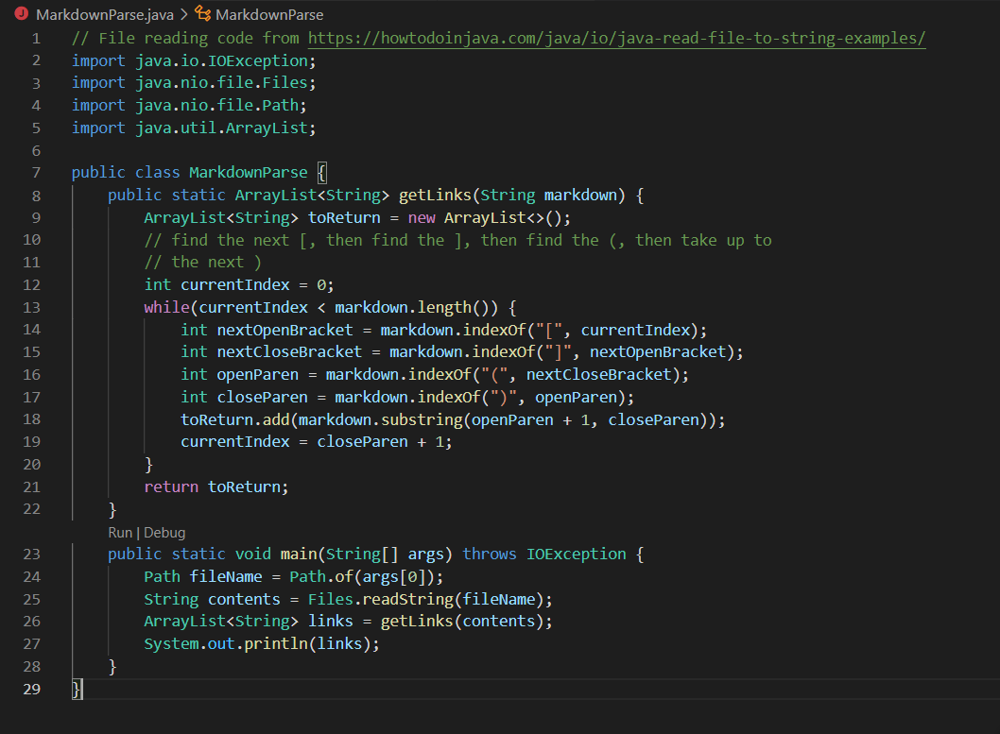
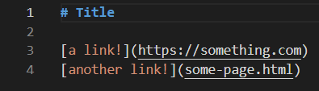
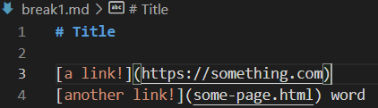
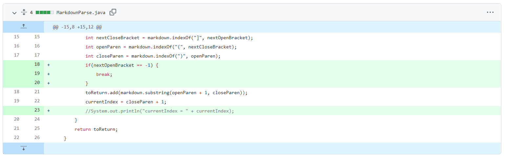

# Week 4 Lab Report: MarkdownParse.java

In this Lab, I looked at the MarkdownParse.java file, which reads markdown files and returns the links in the file in brackets, separated by commas. This code was started by Professor Joe, and my task was to fix bugs that were found in the file.

The starter code looked like this:

It worked correctly for the given [markdown file](LR2/test-file.md), shown below:

## **Bug 1**

The first bug my group tested was a markdown file where additional text came after a link.

[Markdown file:](LR2/break1.md)

The MarkdownParse's output was an infinite loop:

In this example, the bug was the code not accounting for text to be at the end of the file. Because of this, it became stuck in the while loop since the currentIndex value never updated to equal the size of the file. This bug caused the symptom of an infinite loop.

This is the code changes we made to fix the bug:

With this fix, the code would stop running if it cannot find a new open bracket.

## **Bug 2**

