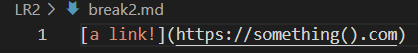
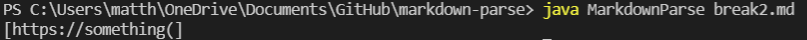
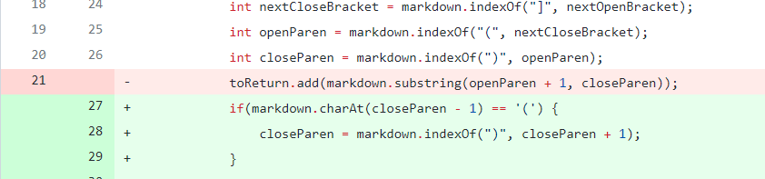
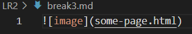
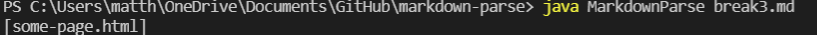
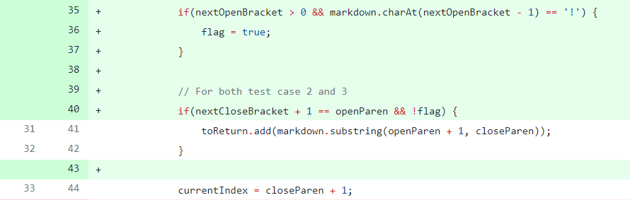

# **Week 4 Lab Report: MarkdownParse.java**

[To Home](https://matthewrsun.github.io/cse15l-lab-reports/)

In this Lab, I looked at the MarkdownParse.java file, which reads markdown files and returns the links in the file in brackets, separated by commas. This code was started by Professor Joe, and my task was to fix bugs that were found in the file.

The starter code looked like this:

It worked correctly for the given [markdown file](LR2/test-file.md), shown below:

## **Bug 1**

The first bug my group tested was a markdown file where additional text came after a link.

[Markdown file:](LR2/break1.md)

The MarkdownParse's output was an infinite loop:

In this example, the bug was the code not accounting for text to be at the end of the file. Because of this, it became stuck in the while loop since the currentIndex value never updated to equal the size of the file. This bug caused the symptom of an infinite loop.

This is the code changes we made to fix the bug:

With this fix, the code would stop running if it cannot find a new open bracket.

## **Bug 2**

The next bug that was tested was a markdown file where there was a set of parentheses within the link.

[Markdown file:](LR2/break2.md)

This file resulted in an incorrect output, shown here:

In this example, the bug was the code labeling the first close parentheses after an open parentheses as the end of the link. This creates the sympton where the program substrings the link at the close parentheses inside the link, not the close parentheses that represented the end of the link format. Thus, the ").com" part of the link was not included.

With this fix, the code would check to see if there was a set of parentheses such as "()" and if so, would skip that set. This only works if there is nothing inside, so links like "(this).com" would still cause a failure. However, since this was not the bug that we were testing, this code was a fix for our bug.

## **Bug 3**

The third bug that was tested was a markdown file where the file had an image, not a link.

[Markdown file:](LR2/break3.md)

This file returned the image link instead of an empty list:

In this example, the bug was the code running the same way it would as if the image was a link URL. Because of this, the symptom was a list of "some-page.html" even though the program should not have included the image URL.

To fix this bug, we added a flag boolean that checks if there is an exclamation point before the open bracket. If so, the program would skip that link.

## **Closing**

This was my lab report for weeks 3 and 4, where my group practiced fixing bugs in a program. Thank you for reading my report!

[To Home](https://matthewrsun.github.io/cse15l-lab-reports/)
