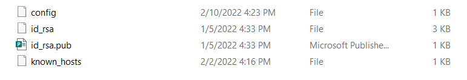
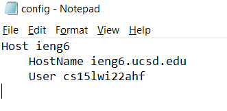
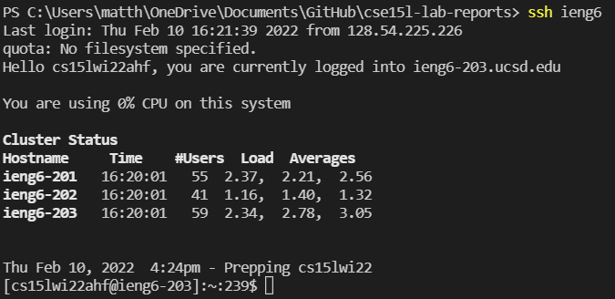
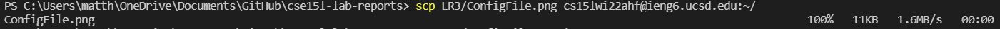

# **Week 6 - Lab Report 3: Streamlining SSH Configuration**

[To Home](https://matthewrsun.github.io/cse15l-lab-reports/)

In this lab report, we will be streamlining the login process to your school account on the UCSD server! First, find your `ssh./config` file. It should be located in a folder like this:



If there is no config file there, create one in the folder. I did this by creating a new file in the Windows File Explorer. You can also open the folder in VSCode and create the config file in the VSCode program. Similarly, the file can be edited with VSCode. In my case, I used the Notepad function on my computer.

Once your file is created or located, paste this code into the file:

```
Host ieng6
    HostName ieng6.ucsd.edu
    User cs15lwi22zzz (use your username)
```
This code acts as a shortcut that logs in to the UCSD server using the public key you provided in the file. Make sure you replace the last three letters with your account specific username!

In my case, my config file looks like this:



Save the config file and try to run the command `ssh ieng6` on your terminal. If all goes well, you should automatically connect to the server!



If this didn't work, you can add an additional line in the config file that refers directly to your `id_rsa` file:

```
Host ieng6
    HostName ieng6.ucsd.edu
    User cs15lwi22zzz (use your username)
    IdentityFile ~/.ssh/id_rsa_ucsd
```
You can use this to directly use `scp` to your school account:



With this, the time it takes to switch to a server is greatly reduced. Yay, efficiency!

[To Home](https://matthewrsun.github.io/cse15l-lab-reports/)
