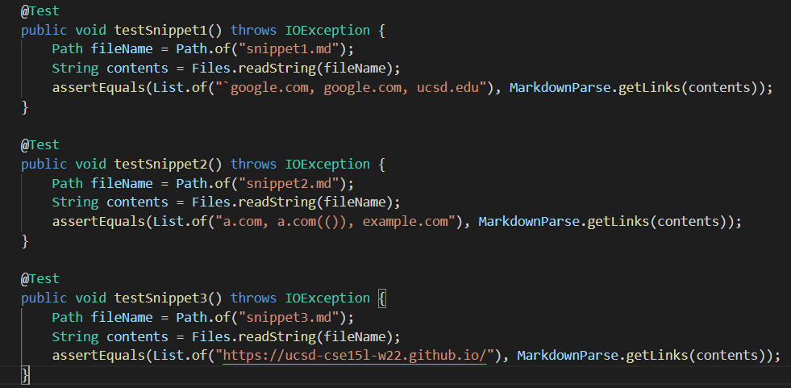
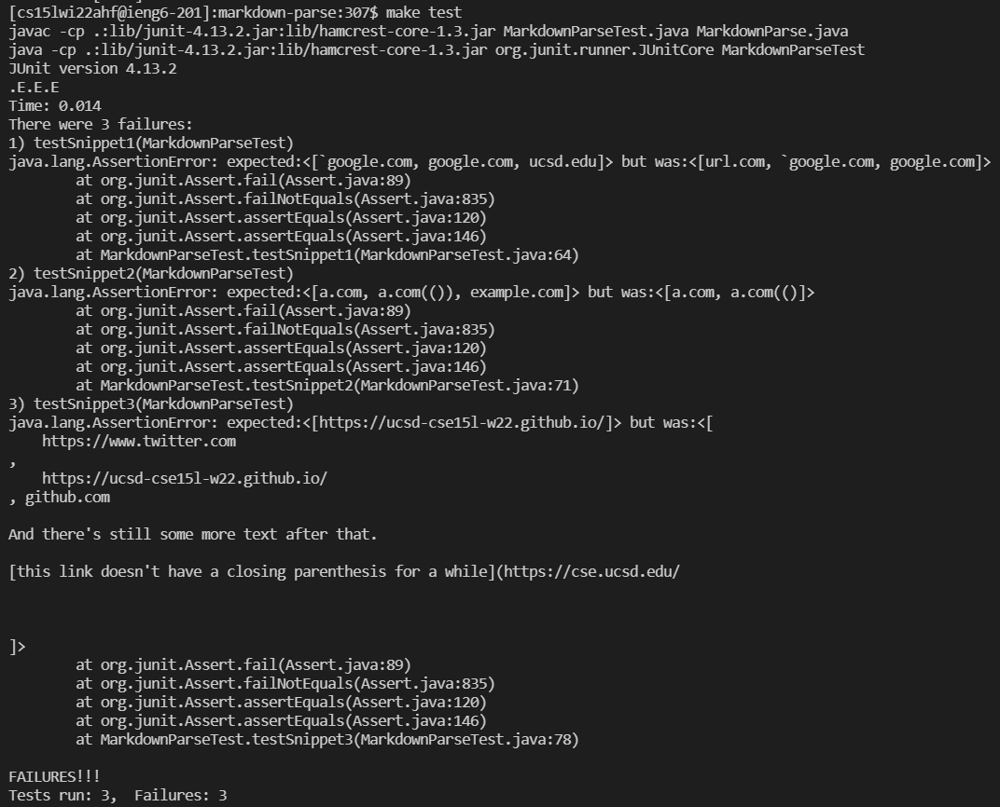
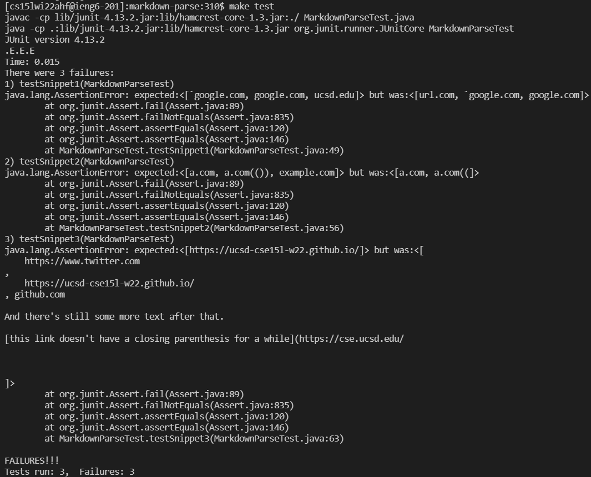

# **Week 8 - Lab Report 4: Debugging**

[To Home](https://matthewrsun.github.io/cse15l-lab-reports/)

Hello! In this lab report, I will be covering additional debugging of the MarkdownParse code. I will be using my own MarkdownParse repository, as well as a repository from another person. These two repos will be tested using 3 different snippets of text to test if the code returns the intended output. These snippets are shown below:

## Snippet 1

```
`[a link`](url.com)

[another link](`google.com)`

[`cod[e`](google.com)

[`code]`](ucsd.edu)
```

## Snippet 2

```
[a [nested link](a.com)](b.com)

[a nested parenthesized url](a.com(()))

[some escaped \[ brackets \]](example.com)
```

## Snippet 3

```
[this title text is really long and takes up more than 
one line

and has some line breaks](
    https://www.twitter.com
)

[this title text is really long and takes up more than 
one line](
    https://ucsd-cse15l-w22.github.io/
)


[this link doesn't have a closing parenthesis](github.com

And there's still some more text after that.

[this link doesn't have a closing parenthesis for a while](https://cse.ucsd.edu/


)

And then there's more text
```

The expected outputs of these three snippets were determined using the [CommonMark demo site](https://spec.commonmark.org/dingus/), resulting in these three tests:



These three tests were used on both repositories, so a total of 6 tests were run.

## My MarkdownParse

For my repository, all three tests failed.



## Other MarkdownParse

In addition, the other repository failed all three tests as well.



## Snippet 1 Fix

I believe a fix for this bug would be to first check for the indexes of two backticks. It seems like parentheses are not affected by backticks, so the code should only look for brackets, both open and closed, in between the two indexes. If it finds a bracket within the backticks, it moves the currentIndex past the second backtick and continues the code.

## Snippet 2 Fix

This bug will be more difficult to fix because the code must check for several types of nested characters. In addition, there may be links with more than two nested characters in a row, so it will likely require more than 10 lines of code to fix. This code would probably find if the index of the next closed character (bracket or parentheses) comes before the next open character. If it isn't, then the code will need to figure out if the nested characters form a valid url or not.

## Snippet 3 Fix

This bug should have an easy fix. MarkdownParse only needs to check in between the parentheses for line breaks (\n) and spaces. Links with spaces before and after them are valid, such as:

```
[this title text is really long and takes up more than 
one line](
    https://ucsd-cse15l-w22.github.io/
)
```

However, links with line breaks are not considered links by the [CommonMark demo site](https://spec.commonmark.org/dingus/).

In addition, it would also need to check if an open bracket is found before a closed parentheses, so that links without closing parentheses do not cause an error in the code.

The fixes to these three bugs can be applied to both my repository and the other one. Both repositories returned similar results, so the bug fix is similar as well.

This concludes Lab Report 4. Thank you for reading!

[To Home](https://matthewrsun.github.io/cse15l-lab-reports/)