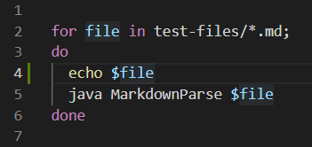

# **Week 10 - Lab Report 5: Differences in Two Repositories**

[To Home](https://matthewrsun.github.io/cse15l-lab-reports/)

# Introduction

In this lab report, I ran two different MarkdownParse repositories against 652 test files.

[Repository 1, given in Lab 9.](https://github.com/ucsd-cse15l-w22/markdown-parse)

[Repository 2, own repo.](https://github.com/FrancGarcia/markdown-parse)

These tests were run using a bash script, shown below:



Using the command `bash script.sh > results.txt`, I created two separate results.txt files in the two repos. To find tests that returned different results, I used `diff Week9/markdown-parse/results.txt fransisco-mdp/markdown-parse/results.txt`, which took the two results.txt files and showed their differences in content.

From this output, I found two different bugs in the repos' code.

# Bug 1

Txt file:

```
[foo](/bar\* "ti\*tle")
```

The first bug is seen in this image of the output:


Using the [CommonMark Demo](https://spec.commonmark.org/dingus/), I determined that both implementations are incorrect. The expected result is "foo" with a hyperlink for ti*tle.


In the given repository (repo 1), the bug can be found in this section of code:


The code correctly found the potential string within the parentheses, `/bar\* "ti\*tle"`, but since there was still a space within that string, the string was not returned as a potential link, leading to an output of `[]`.

To fix this bug, the MarkdownParse code should see that there is a space within the link, and determine which part of the string contains the actual link. As CommonMark shows, a link that contains spaces can still be a link, so the code shouldn't skip the code if it contains a space.

## Bug 2

Txt file:

```
[link](foo(and(bar)))
```

The second bug can be seen in this image:


Using CommonMark, I determined that the correct output is "link" with a hyperlink to foo(and(bar)).


This means that the output for repo 1 is correct, while the implementation of repo 2 is incorrect.

The issue with the code in repo 1 is that the link is substringed at the closest close parentheses without checking for nested paired parentheses.

![]

[To Home](https://matthewrsun.github.io/cse15l-lab-reports/)
